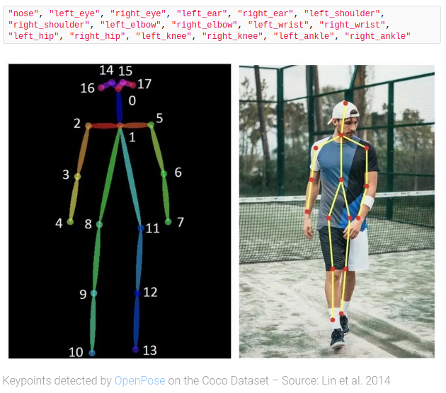

# Overview


# Method overview
## Top-down & bottom-up approaches
+ **Bottom-up** approach: without using person detector.
+ **Top-down** methods run a person detector first and estimate body joints within the detected bounding boxes
## AlphaPose
  + [github_link](https://github.com/MVIG-SJTU/AlphaPose)
  + RMPE or Alpha-Pose is a well-known **top-down** technique of post estimation.
  + [introduce](https://www.mvig.org/research/alphapose.html)
  + **AlphaPose** is an accurate multi-person pose estimator.
  + Apr 2019: MXNet version of AlphaPose is released! It runs at 23 fps on COCO validation set.
  + Sep 2018: PyTorch version of AlphaPose is released! It runs at 20 fps on COCO validation set (4.6 people per image on average) and achieves 71 mAP!
  + The most important feature of Alpha-Pose is that it can be extended to any blend of a **person detection** algorithm and an **SPPE**.
### Installation
  + Copy folder PoseEstimate is done.
## OpenPose
  + [github_link](https://github.com/CMU-Perceptual-Computing-Lab/openpose)
  + Hard to build (C++)
  + **Bottom-up** approaches
  + 
  + Performance with less person < alphapose. But const with people increase.
  + Have python API for custom functionality
### Installation
  + cmake-gui .. error
  + not found lbpthreads.
  + docker 
    + image 5G
    + Test image error cuda.
## MMpose
  + [github_link](https://github.com/open-mmlab/mmpose)

### Inference speed
+ [inference_speed](https://github.com/open-mmlab/mmpose/blob/master/docs/en/inference_speed_summary.md)
  + GPU: GeForce GTX 1660 SUPER
  + Only measure the time for model forwarding and data post-processing.

### Installation
```commandline
conda install pytorch==1.8.0 torchvision==0.9.0 cudatoolkit=10.2 -c pytorch
pip install mmcv-full -f https://download.openmmlab.com/mmcv/dist/cu102/torch1.8.0/index.html
pip install -r requirements.txt
pip install -v -e .
```
Done

### How to run test
+ Model save to :  /home/gg-greenlab/.cache/torch/hub/checkpoints/hrnet_w48_coco_256x192-b9e0b3ab_20200708.pth
+ 


## Note
+ Predict skeleton pose of each bboxs or full image.
+ 
# Reference: 
  + [movenet_pytorch](https://github.com/lee-man/movenet-pytorch) 
  + [AlphaPose](https://github.com/MVIG-SJTU/AlphaPose)
  + [overview](https://viso.ai/deep-learning/pose-estimation-ultimate-overview/)
## Compare
  + https://www.libhunt.com/compare-openpifpaf-vs-mmpose
  + [overview-top_opensource](https://medium0.com/m/global-identity?redirectUrl=https%3A%2F%2Fmedium.datadriveninvestor.com%2Ftop-and-best-computer-vision-human-pose-estimation-projects-186d04204dde)
  + [openpose vs alphapose vs mask_rcnn](https://viso.ai/deep-learning/openpose/)